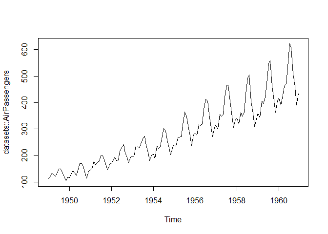

<!-- README.md is generated from README.Rmd. Please edit that file -->

# ssa.hts

<!-- badges: start -->
<!-- badges: end -->

The goal of ssa.hts is to use singular spectrum analysis to forecast
hierarchical time series.

## Installation

You can install the development version of ssa.hts from
[GitHub](https://github.com/) with:

``` r
# install.packages("devtools")
devtools::install_github("numbats/assignment-1-package-creation-paulocanas")
```

## Example

This is a basic example which shows you how to solve a common problem:

``` r
library(ssa.hts)
## basic example code
x <- datasets::AirPassengers[1:15]
L <- 8
ssa.hts::hankel_matrix(x, L)
#>      [,1] [,2] [,3] [,4] [,5] [,6] [,7] [,8]
#> [1,]  112  118  132  129  121  135  148  148
#> [2,]  118  132  129  121  135  148  148  136
#> [3,]  132  129  121  135  148  148  136  119
#> [4,]  129  121  135  148  148  136  119  104
#> [5,]  121  135  148  148  136  119  104  118
#> [6,]  135  148  148  136  119  104  118  115
#> [7,]  148  148  136  119  104  118  115  126
#> [8,]  148  136  119  104  118  115  126  141
```

What is special about using `README.Rmd` instead of just `README.md`?
You can include R chunks like so:

``` r
summary(cars)
#>      speed           dist       
#>  Min.   : 4.0   Min.   :  2.00  
#>  1st Qu.:12.0   1st Qu.: 26.00  
#>  Median :15.0   Median : 36.00  
#>  Mean   :15.4   Mean   : 42.98  
#>  3rd Qu.:19.0   3rd Qu.: 56.00  
#>  Max.   :25.0   Max.   :120.00
```

\#You’ll still need to render `README.Rmd` regularly, to keep
`README.md` up-to-date. `devtools::build_readme()` is handy for this.

Plot of the data:



\#In that case, don’t forget to commit and push the resulting figure
files, so they display on GitHub and CRAN.
